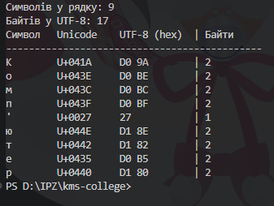

# Самостійна робота №2
## Студент: Матвійчук Роман
## Група: ІПЗ-4/2
## Тема: Кодування символів: ASCII, Unicode, UTF-8
## Варіант: 8

## Завдання 1.

Кирилиця зазвичай займає 2 байти на символ.

Для рядка слово Комп’ютер розписано кодову точку Unicode кожного символу та його побайтове представлення в кодуванні UTF-8 (у шістнадцятковій формі):
| Символ | Кодова точка Unicode | Байти UTF-8 (hex) | Кількість байтів |
|---|---|---|---:|
| К | U+041A | `D0 9A` | 2 |
| о | U+043E | `D0 BE` | 2 |
| м | U+043C | `D0 BC` | 2 |
| п | U+043F | `D0 BF` | 2 |
| ’ | U+2019 | `E2 80 99` | 3 |
| ю | U+044E | `D1 8E` | 2 |
| т | U+0442 | `D1 82` | 2 |
| е | U+0435 | `D0 B5` | 2 |
| р | U+0440 | `D1 80` | 2 |

Слово: Комп’ютер.

## Завдання 2.

Для перевірки ручного розрахунку написано програму мовою Python:

[Переглянути код](./independentWork2.py)

## Результат:

## Завдання 3.

У кодуванні UTF-8 довжина рядка в символах і байтах відрізняється, оскільки UTF-8 є кодуванням змінної довжини (від 1 до 4 байтів на один символ).

Для прикладу Комп'ютер:
Для рядка **Комп’ютер**:

* Загальна кількість символів дорівнює 9.
* Загальний обсяг у байтах становить **19 байтів.
* 0 символів кодуються 1 байтом (символи ASCII відсутні).
* 8 символів (усі кириличні літери: К, о, м, п, ю, т, е, р) кодуються 2 байтами кожний (разом 16 байтів).
* 1 символ (типографський апостроф `’` U+2019) кодується 3 байтами (`E2 80 99`).
* 0 символів кодуються 4 байтами.

## Завдання 4.

Для аналізу обрано емодзі 💻 (ноутбук):

* Кодова точка Unicode: `U+1F4BB`
* Кодування в UTF-16 (hex): `0xD83D 0xDCBB` (сурогатна пара)

Сурогатна пара у кодуванні UTF-16 необхідна для представлення символів із кодовими точками, більшими за `U+FFFF` (поза межами основної багатомовної площини BMP), оскільки однієї 16-бітової одиниці (2 байтів) для них недостатньо.