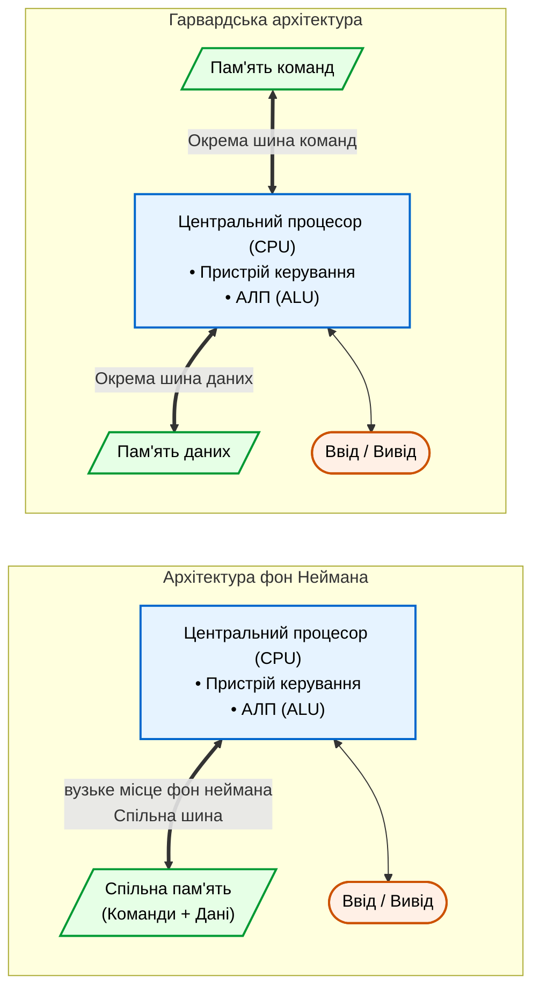

# Домашня завдання з лекції №1
## Студент: Матвійчук Роман
## Група: ІПЗ-4/2

### 1. Накресліть структуру архітектури фон Неймана і Гарвардської архітектури поруч, позначивши, де саме проходить вузьке місце фон Неймана.

Архітектура фон Неймана показана спільний блок пам'яті для команд і даних, а також єдину шину, яка є вузьким місцем (bottleneck), оскільки обмежує можливість одночасної вибірки команд та операнда.

Гарвардська архітектура продемонстрована фізичний розподіл пам'яті на блок команд (Instructions) та блок даних (Data), кожен з яких має власну виділену шину для забезпечення паралельного доступу.

### 2. Для трьох пристроїв - смартфон, мікроконтролер пральної машини, ігрова консоль з відеокартою - визначте клас за класифікацією Флінна (SISD, SIMD, MISD, MIMD) і обгрунтуйте вибір.

Мікронотролер пральної машини відноситься до класа SISD.

Тому що це класична вбудована система з обмеженими ресурсами, яка зазвичай працює без операційної системи. Вона виконує одну конкретну керівну програму послідовно - крок за кроком обробляє по одному елементу даних (наприклад, зчитує поточне значення з датчика температури або рівня води й подає сигнал на реле) за один такт циклу.

Смартфон відноситься до класа MIMD.

Тому що сучасний смартфон має потужний багатоядерний центральний процесор (CPU). Кожне з ядер процесора здатне незалежно виконувати власні інструкції (свій потік команд) над власними операндами (своїм потоком даних). Це дозволяє смартфону одночасно виконувати безліч завдань у фоновому режимі (відтворювати музику, оновлювати геопозицію, підтримувати роботу месенджерів тощо).

Ігрова консоль з відеокартою це гетерогенна MIMD-SIMD система.

Тому що консоль є складним гібридним комплексом.

Її центральний процесор (CPU) є багатоядерним і працює за принципом MIMD, паралельно розподіляючи різні завдання гри (ігрову логіку, штучний інтелект персонажів, фізику об'єктів) по різних ядрах.
А її графічний процесор (GPU) побудований на базі архітектури SIMD (Single Instruction, Multiple Data stream). Для швидкого рендерингу тривимірної графіки GPU застосовує одну й ту саму інструкцію (наприклад, розрахунок освітлення пікселя чи трансформацію вершини) одночасно до величезних масивів аналогічних даних (мільйонів пікселів або полігонів на екрані).

### 3. Знайдіть помилку в твердженні: “У Гарвардській архітектурі команди й дані зберігаються в одній пам’яті, тому вибірка команди й читання даних відбуваються по черзі через ту саму шину” - і поясніть, чому воно неправильне.

Помилку в тому, що у цьом твердженні допущено принципову фактологічну помилку - наведений опис повністю відповідає архітектурі фон Неймана, а не Гарвардській.

Воно неправильне тому, що:

1. У Гарвардській архітектурі команди та дані зберігаються фізично окремо (у різних блоках пам'яті), а не в одній.
2. Процесор підключається до цих блоків через дві роздільні шини ш шину команд та шину даних.
3. Завдяки роздільним шинам вибірка чергової команди та читання або запис даних відбуваються одночасно (паралельно), а не по черзі. Саме це усуває обмеження спільної шини (вузьке місце) та підвищує швидкодію виконання програм.