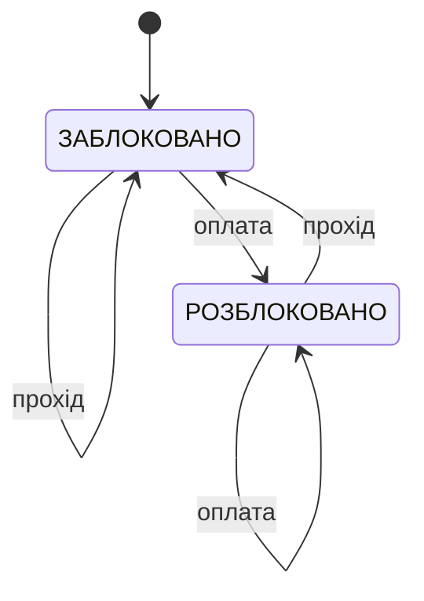

# Домашнє завдання з лекції №4
## Студент: Матвійчук Роман
## Група: ІПЗ-4/2

## Завдання 1. Таблиця переходів JK-тригера

**Умова:** Заповніть таблицю переходів JK-тригера для всіх чотирьох комбінацій J і K (00, 01, 10, 11), вказавши наступний стан виходу відносно поточного, і поясніть, чому цей тригер вважають універсальним порівняно з RS-тригером.

### Таблиця переходів:

| $J$ | $K$ | Наступний стан $Q(t+1)$ | Режим | Пояснення |
| :---: | :---: | :---: | :---: | :--- |
| 0 | 0 | $Q(t)$ | зберігання | входи неактивні, тригер утримує попереднє значення |
| 0 | 1 | 0 | скидання (reset) | вихід примусово встановлюється в 0 |
| 1 | 0 | 1 | встановлення (set) | вихід примусово встановлюється в 1 |
| 1 | 1 | $\overline{Q(t)}$ | перемикання (toggle) | вихід змінюється на протилежний |

### Розгорнута таблиця (з урахуванням поточного стану):

| $J$ | $K$ | $Q(t)$ | $Q(t+1)$ |
| :---: | :---: | :---: | :---: |
| 0 | 0 | 0 | **0** |
| 0 | 0 | 1 | **1** |
| 0 | 1 | 0 | **0** |
| 0 | 1 | 1 | **0** |
| 1 | 0 | 0 | **1** |
| 1 | 0 | 1 | **1** |
| 1 | 1 | 0 | **1** |
| 1 | 1 | 1 | **0** |

Цю поведінку описує характеристичне рівняння:
$$Q(t+1) = J \wedge \overline{Q(t)} \vee \overline{K} \wedge Q(t)$$

### Чому JK-тригер універсальний:
1. **Немає забороненої комбінації.** У RS-тригері комбінація $S = R = 1$ дає невизначений результат і на практиці не використовується. У JK-тригері відповідна комбінація $J = K = 1$ має чітко визначену поведінку — перемикання виходу в протилежний стан.
2. **Він може замінити інші тригери:**
   * якщо не подавати $J = K = 1$, він працює як **RS-тригер** ($J$ — це $S$, $K$ — це $R$);
   * якщо з'єднати $J$ і $K$ разом ($J = K = T$), отримаємо **T-тригер**;
   * якщо подати $J = D$, $K = \overline{D}$, отримаємо **D-тригер**.

Отже, на основі одного JK-тригера можна реалізувати поведінку будь-якого з тригерів RS, D і T, тому його і вважають універсальним.

---

## Завдання 2. Скінченний автомат турнікета в метро

**Умова:** Накресліть граф переходів скінченного автомата для турнікета в метро зі станами ЗАБЛОКОВАНО і РОЗБЛОКОВАНО, де вхідні події - «оплата» і «прохід». Визначте, чи це автомат Мура, чи Мілі, і обґрунтуйте.

### Граф переходів:



### Таблиця переходів:

| Поточний стан | Вхід «оплата» | Вхід «прохід» |
| :---: | :---: | :---: |
| ЗАБЛОКОВАНО | РОЗБЛОКОВАНО | ЗАБЛОКОВАНО |
| РОЗБЛОКОВАНО | РОЗБЛОКОВАНО | ЗАБЛОКОВАНО |

### Пояснення переходів:
* **ЗАБЛОКОВАНО + оплата → РОЗБЛОКОВАНО** — пасажир оплатив проїзд, турнікет відкривається.
* **ЗАБЛОКОВАНО + прохід → ЗАБЛОКОВАНО** — спроба пройти без оплати, турнікет залишається заблокованим.
* **РОЗБЛОКОВАНО + прохід → ЗАБЛОКОВАНО** — пасажир пройшов, турнікет знову блокується.
* **РОЗБЛОКОВАНО + оплата → РОЗБЛОКОВАНО** — повторна оплата нічого не змінює, турнікет лишається відкритим.

### Тип автомата: автомат Мура

**Обґрунтування:** вихід турнікета (стулки зачинені / відчинені, індикатор червоний / зелений) визначається **лише поточним станом**:

| Стан | Вихід |
| :---: | :---: |
| ЗАБЛОКОВАНО | стулки зачинені (червоний індикатор) |
| РОЗБЛОКОВАНО | стулки відчинені (зелений індикатор) |

Вхідна подія лише спричиняє перехід у новий стан, а вихід змінюється синхронно зі зміною стану. Якщо ж вихід залежав би ще й від поточного входу (наприклад, звуковий сигнал «помилка» саме в момент події «прохід» у стані ЗАБЛОКОВАНО), це був би автомат Мілі.

---

## Завдання 3. Паралельний і зсувний 4-бітні регістри

**Умова:** Опишіть словами, як з чотирьох D-тригерів побудувати 4-бітний паралельний регістр, і поясніть, чим його поведінка відрізнялася б від 4-бітного зсувного регістра при подачі того самого вхідного слова.

### Побудова паралельного регістра:
1. Беремо чотири D-тригери — по одному на кожен розряд слова ($D_3, D_2, D_1, D_0$).
2. На вхід $D$ кожного тригера подаємо **окрему вхідну лінію** відповідного розряду.
3. Входи синхронізації (CLK) усіх чотирьох тригерів з'єднуємо в **один спільний тактовий сигнал**.
4. Виходи $Q_3, Q_2, Q_1, Q_0$ тригерів утворюють 4-бітний вихід регістра.

```text
 D3 ──►[D  Q]──► Q3
 D2 ──►[D  Q]──► Q2
 D1 ──►[D  Q]──► Q1
 D0 ──►[D  Q]──► Q0
         ▲
CLK ─────┴── (спільний для всіх тригерів)
```

### Побудова зсувного регістра (для порівняння):
Ті самі чотири D-тригери з'єднуються **ланцюжком**: вхід першого тригера — це послідовний вхід даних, а вихід кожного тригера подається на вхід $D$ наступного ($Q_3 \to D_2$, $Q_2 \to D_1$, $Q_1 \to D_0$). Тактовий сигнал також спільний.

```text
 IN ──►[D Q3]──►[D Q2]──►[D Q1]──►[D Q0]──► (виштовхнутий біт)
```

### Порівняння при подачі слова 1011 (початковий стан 0000):

**Паралельний регістр** — усе слово записується за **1 такт**:

| Такт | $D_3\,D_2\,D_1\,D_0$ | $Q_3\,Q_2\,Q_1\,Q_0$ |
| :---: | :---: | :---: |
| 0 | — | 0 0 0 0 |
| 1 | 1 0 1 1 | **1 0 1 1** |

**Зсувний регістр (зсув вправо)** — біти подаються по одному, починаючи з молодшого, слово записується за **4 такти**:

| Такт | Вхідний біт | $Q_3\,Q_2\,Q_1\,Q_0$ |
| :---: | :---: | :---: |
| 0 | — | 0 0 0 0 |
| 1 | 1 | 1 0 0 0 |
| 2 | 1 | 1 1 0 0 |
| 3 | 0 | 0 1 1 0 |
| 4 | 1 | **1 0 1 1** |

### Відмінності у поведінці:

| Ознака | Паралельний регістр | Зсувний регістр |
| :--- | :--- | :--- |
| Кількість вхідних ліній | 4 (по одній на розряд) | 1 (послідовний вхід) |
| Спосіб запису | усі біти одночасно | по одному біту на такт |
| Тактів на 4-бітне слово | 1 | 4 |
| Проміжні стани | немає — слово з'являється на виході цілком | є — на виходах видно частково зсунуте слово |
| Типове застосування | зберігання операнда, регістровий файл | послідовно-паралельне перетворення, буфери UART |

**Висновок:** паралельний регістр фіксує все слово одним тактовим фронтом, бо кожен тригер має власний вхід даних. У зсувному регістрі тригери пов'язані між собою, тож біти «просуваються» ланцюжком, і для запису $n$-бітного слова потрібно $n$ тактів — зате достатньо лише однієї вхідної лінії.
