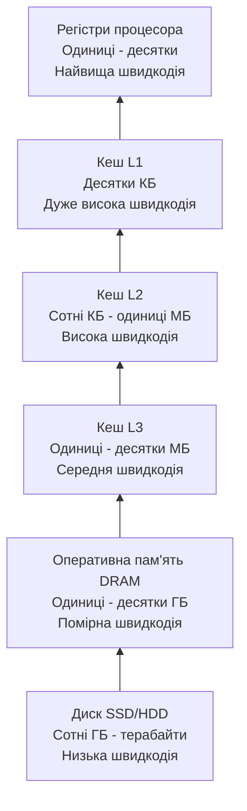

# Домашнє завдання з лекції №6
## Студент: Матвійчук Роман
## Група: ІПЗ-4/2

## Завдання 1. Піраміда ієрархії пам'яті

Ієрархія пам'яті побудована так, що ближчі до процесора рівні є швидшими,
але мають менший обсяг. Чим далі рівень від процесора, тим він повільніший,
зате його обсяг більший.



| Рівень пам'яті | Орієнтовний обсяг | Орієнтовна швидкодія |
|---|---|---|
| Регістри процесора | одиниці - десятки | найвища, частки такту |
| Кеш L1 | десятки кілобайт | дуже висока |
| Кеш L2 | сотні кілобайт - одиниці мегабайт | висока |
| Кеш L3 | одиниці - десятки мегабайт | середня |
| Оперативна пам'ять (DRAM) | одиниці - десятки гігабайт | помірна |
| Диск (SSD/HDD) | сотні гігабайт - терабайти | низька |

Мета такої ієрархії — створити для програми ілюзію великої та одночасно
швидкої пам'яті. Найчастіше потрібні дані зберігаються у швидких верхніх
рівнях, а менш потрібні — у пам'яті більшого обсягу.

## Завдання 2. Порівняння обходу масиву

Розглянемо масив мовою C:

```c
int a[100][100];
```

У мові C елементи двовимірного масиву зберігаються в пам'яті **по рядках**.
Тобто спочатку розміщені всі елементи першого рядка, потім другого і так далі.

### Обхід по рядках

```c
for (int i = 0; i < 100; i++) {
    for (int j = 0; j < 100; j++) {
        sum += a[i][j];
    }
}
```

Під час такого обходу після `a[i][j]` процесор звертається до сусіднього
елемента `a[i][j + 1]`. Оскільки сусідні елементи вже знаходяться в одному
або близьких рядках кешу, більшість звернень є влучаннями в кеш.

### Обхід по стовпцях

```c
for (int j = 0; j < 100; j++) {
    for (int i = 0; i < 100; i++) {
        sum += a[i][j];
    }
}
```

У цьому випадку після `a[i][j]` відбувається звернення до `a[i + 1][j]`.
Між цими елементами в пам'яті розташований цілий рядок, тому процесор
переходить через багато непотрібних елементів. Через це кеш використовується
гірше і виникає більше промахів кешу.

### Висновок щодо обходу

Швидшим зазвичай буде обхід **по рядках**, тому що він відповідає порядку
розміщення даних у пам'яті. У ньому добре використовується **просторова
локальність**: після звернення до одного елемента скоро використовуються
сусідні елементи, які кеш уже завантажив одним рядком.

Обхід по стовпцях дає більше промахів кешу і тому може виконуватися довше.
Кількість операцій у двох варіантах однакова, але відрізняється кількість
очікувань повільнішої пам'яті.

## Завдання 3. Стратегії `write-back` і `write-through`

### Поведінка `write-back`

Якщо рядок кешу був змінений процесором, він позначається як **брудний**
(`dirty`). При цьому нове значення спочатку записується тільки в кеш, а
оперативна пам'ять ще містить старе значення.

Коли брудний рядок потрібно витіснити з кешу, відбуваються такі дії:

1. Процесор або контролер кешу виявляє, що рядок має ознаку `dirty`.
2. Змінений рядок записується назад у нижчий рівень пам'яті, наприклад у DRAM.
3. Після успішного запису рядок можна замінити новими даними.

Перевага `write-back` полягає в тому, що кілька змін одного рядка кешу
об'єднуються в один запис до оперативної пам'яті. Недоліком є те, що нижчий
рівень деякий час містить застарілу копію даних, тому під час витіснення
потрібно обов'язково виконати запис.

### Поведінка `write-through`

При стратегії `write-through` кожна операція запису одразу виконується і в
кеші, і в наступному рівні пам'яті. Тому оперативна пам'ять постійно містить
актуальне значення.

Якщо рядок кешу витісняється при `write-through`, його не потрібно додатково
записувати в DRAM, оскільки всі зміни вже були передані туди раніше.

### Порівняльна таблиця

| Ознака | `write-back` | `write-through` |
|---|---|---|
| Куди записується зміна | Спочатку тільки в кеш | Одразу в кеш і нижчий рівень |
| Стан оперативної пам'яті | Може бути застарілим до витіснення рядка | Завжди актуальний |
| Запис при витісненні | Потрібен для брудного рядка | Не потрібен |
| Кількість звернень до DRAM | Менша | Більша |
| Швидкодія запису | Зазвичай вища | Зазвичай нижча |

Отже, у заданій ситуації при `write-back` брудний рядок перед витісненням
спочатку записується в оперативну пам'ять. При `write-through` такої окремої
дії під час витіснення немає, тому що дані вже були записані в пам'ять.

## Висновок

Під час виконання домашнього завдання я розглянув ієрархію пам'яті та
порівняв її рівні за обсягом і швидкодією. Я з'ясував, що для масиву
`int a[100][100]` обхід по рядках використовує просторову локальність краще,
ніж обхід по стовпцях. Також я порівняв стратегії `write-back` і
`write-through`: у першій змінені дані записуються в пам'ять під час
витіснення брудного рядка, а в другій — одразу під час кожного запису.