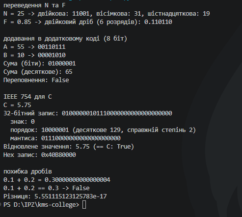

# Практична робота №2
## Студент: Матвійчук Роман
## Група: ІПЗ-4/2
## Варіант №8

## 1.  
### N = 25
 
| Основа | Ділення | Результат |
|---|---|---|
| 2 | 25:2=12(ост.1) -> 12:2=6(ост.0) → 6:2=3(ост.0) -> 3:2=1(ост.1) -> 1:2=0(ост.1) | **11001** |
| 8 | 25:8=3(ост.1) → 3:8=0(ост.3) | **31** |
| 16 | 25:16=1(ост.9) → 1:16=0(ост.1) | **19** |
 
### F = 0.85
 
| № | Дія | Біт | Залишок |
|---|---|---|---|
| 1 | 0.85×2=1.70 | 1 | 0.70 |
| 2 | 0.70×2=1.40 | 1 | 0.40 |
| 3 | 0.40×2=0.80 | 0 | 0.80 |
| 4 | 0.80×2=1.60 | 1 | 0.60 |
| 5 | 0.60×2=1.20 | 1 | 0.20 |
| 6 | 0.20×2=0.40 | 0 | 0.40 |
 
**F ≈ 0.110110**
 
---
 
## 2.
 
```python
import struct
 
 
def int_to_base(n: int, base: int) -> str:
    """Переведення цілого числа в систему числення з основою 2..16 (ділення на основу)."""
    if n == 0:
        return "0"
    digits = "0123456789ABCDEF"
    sign = "-" if n < 0 else ""
    n = abs(n)
    out = ""
    while n > 0:
        out = digits[n % base] + out
        n //= base
    return sign + out
 
 
def frac_to_base(f: float, base: int, precision: int = 6) -> str:
    """Переведення дробової частини в систему з основою base (множення на основу)."""
    digits = "0123456789ABCDEF"
    out = ""
    frac = f
    for _ in range(precision):
        frac *= base
        d = int(frac)
        out += digits[d]
        frac -= d
    return out
 
 
def twos_complement(n: int, bits: int = 8) -> str:
    """Запис цілого числа (додатного або від'ємного) у додатковому коді розрядністю bits."""
    if n < 0:
        n = (1 << bits) + n
    return format(n, f'0{bits}b')
 
 
def add_twos_complement(a: int, b: int, bits: int = 8):
    """Додавання a+b у додатковому коді; повертає (біти суми, десяткове значення, прапорець переповнення)."""
    mask = (1 << bits) - 1
    a_bits, b_bits = a & mask, b & mask
    sum_bits = (a_bits + b_bits) & mask
    sign_a = (a_bits >> (bits - 1)) & 1
    sign_b = (b_bits >> (bits - 1)) & 1
    sign_sum = (sum_bits >> (bits - 1)) & 1
    # переповнення: доданки одного знака, а сума - протилежного
    overflow = (sign_a == sign_b) and (sign_sum != sign_a)
    signed_result = sum_bits - (1 << bits) if sign_sum else sum_bits
    return format(sum_bits, f'0{bits}b'), signed_result, overflow
 
 
def float_to_ieee754(c: float):
    """Розбір float за форматом IEEE 754 single (32 біти): знак, порядок, мантиса."""
    packed = struct.pack('>f', c)
    bits = ''.join(f'{byte:08b}' for byte in packed)
    return bits, bits[0], bits[1:9], bits[9:]
 
 
def ieee754_to_float(bits: str) -> float:
    """Відновлення числа з 32-бітного запису IEEE 754."""
    n = int(bits, 2)
    return struct.unpack('>f', n.to_bytes(4, 'big'))[0]
 
 
if __name__ == "__main__":
    N, F, A, B, C = 25, 0.85, 55, 10, 5.75
 
    print("=== Крок 1-2: переведення N та F ===")
    print(f"N = {N} -> двійкова: {int_to_base(N, 2)}, "
          f"вісімкова: {int_to_base(N, 8)}, "
          f"шістнадцяткова: {int_to_base(N, 16)}")
    print(f"F = {F} -> двійковий дріб (6 розрядів): 0.{frac_to_base(F, 2, 6)}")
 
    print("\n=== Крок 3: додавання в додатковому коді (8 біт) ===")
    print(f"A = {A} -> {twos_complement(A)}")
    print(f"B = {B} -> {twos_complement(B)}")
    sum_bits, signed_result, overflow = add_twos_complement(A, B)
    print(f"Сума (біти): {sum_bits}")
    print(f"Сума (десяткове): {signed_result}")
    print(f"Переповнення: {overflow}")
 
    print("\n=== Крок 4: IEEE 754 для C ===")
    bits, sign, exponent, mantissa = float_to_ieee754(C)
    print(f"C = {C}")
    print(f"32-бітний запис: {bits}")
    print(f"  знак: {sign}")
    print(f"  порядок: {exponent} (десяткове {int(exponent, 2)}, "
          f"справжній степінь {int(exponent, 2) - 127})")
    print(f"  мантиса: {mantissa}")
    restored = ieee754_to_float(bits)
    print(f"Відновлене значення: {restored} (== C: {restored == C})")
    print(f"Hex запис: 0x{int(bits, 2):08X}")
 
    print("\n=== Крок 5: похибка дробів ===")
    a, b, expected = 0.1, 0.2, 0.3
    result = a + b
    print(f"{a} + {b} = {result!r}")
    print(f"{a} + {b} == {expected} -> {result == expected}")
    print(f"Різниця: {result - expected!r}")
```
 
`int_to_base(25, 2/8/16)` і `frac_to_base(0.85, 2, 6)` дають ті самі 11001 / 31 / 19 і 0.110110, що й ручний розрахунок у кроці 1 (див. вивід програми нижче).
 
---
 
## 3. Додавання A=55, B=10 у 8-бітному додатковому коді
 
| | Десяткове | Додатковий код (8 біт) |
|---|---|---|
| A | 55 | 00110111 |
| B | 10 | 00001010 |
 
```
переноси:  0 1 1 1 1 1 0 0
       A = 0 0 1 1 0 1 1 1   (55)
     + B = 0 0 0 0 1 0 1 0   (10)
           -----------------
    сума = 0 1 0 0 0 0 0 1   (65)
```
 
**Сума = 01000001 = 65. Переповнення відсутнє**: A і B обидва додатні (знаковий біт 0), сума теж додатна (знаковий біт 0) — знаки доданків збігаються між собою і зі знаком результату. 
---
 
## IEEE 754 single для C = 5.75
 
5.75₁₀ = 101.11₂ = **1.0111 × 2²** (нормалізація)
 
| Компонент | Розряди | Значення |
|---|---|---|
| Знак | 1 | 0 (додатне) |
| Порядок (+127) | 8 | 10000001 → 129₁₀ → справжній степінь 129−127=**2** |
| Мантиса | 23 | 01110000000000000000000 |
 
**32-бітний запис:** `01000000101110000000000000000000` (hex `0x40B80000`)
 
Перевірка зворотним переведенням: 1.0111₂ × 2² = 1.4375 × 4 = **5.75** — збігається з C.
 
---
 
## Крок 5. Похибка дробів: 0.1 + 0.2
 
```
0.1 + 0.2 = 0.30000000000000004
0.1 + 0.2 == 0.3  ->  False
різниця ≈ 5.55×10⁻¹⁷
```
 
0.1, 0.2 і 0.3 — усі періодичні у двійковій системі, кожне зберігається з власним округленням до 52 біт мантиси (double). Сума двох округлених значень майже ніколи точно не збігається з окремо округленим 0.3.
---
 
## Вивід програми (для порівняння з ручними розрахунками)

 
Вивід програми точно збігається з ручними розрахунками для всіх п'яти кроків.
 
---
 
## Висновок
 
Для пари A=55, B=10 переповнення при додаванні в 8-бітному додатковому коді не виникає: сума 65 лишається в діапазоні [-128; 127], а знак результату збігається зі знаком обох доданків. Похибка представлення дробу F=0.85 у двійковій системі ненульова навіть при 6 розрядах: 0.110110₂ = 0.84375, тобто похибка складає 0.85−0.84375 = 0.00625, бо 0.85 — нескінченний періодичний двійковий дріб. Та сама природа похибки видна й у прикладі 0.1+0.2≠0.3: обидва доданки округлені при зберіганні, тому їх точна сума на біт відрізняється від округленого 0.3.