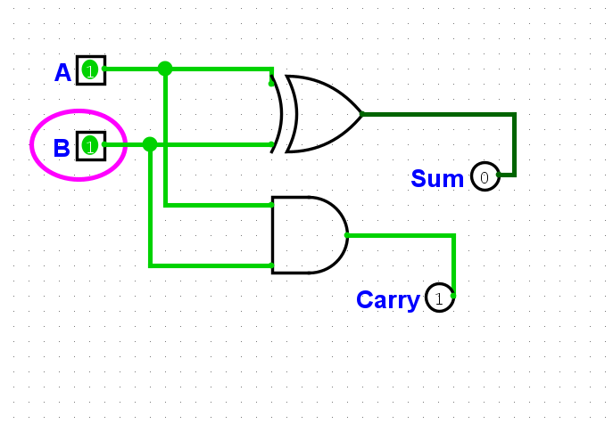
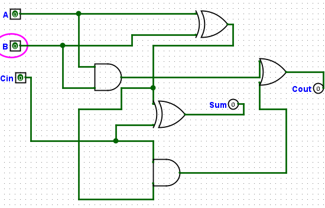
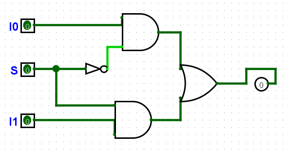
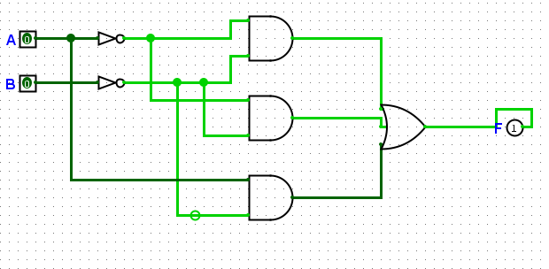
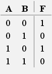

# Практична робота №2
## Студент: Матвійчук Роман
## Група: ІПЗ-4/2
## Варіант №8

## 1. Півсуматор

| A | B | Sum | Carry |
|:-:|:-:|:-----------:|:-------------:|
| 0 | 0 | 0 | 0 |
| 0 | 1 | 1 | 0 |
| 1 | 0 | 1 | 0 |
| 1 | 1 | 0 | 1 |

## 2. Повний суматор

| A | B | Cin | Sum | Cout |
|:-:|:-:|:-----------:|:-------------:|:-------------:|
| 0 | 0 | 0 | 0 | 0 |
| 0 | 0 | 1 | 1 | 0 |
| 0 | 1 | 0 | 1 | 0 |
| 0 | 1 | 1 | 0 | 1 |
| 1 | 0 | 0 | 1 | 0 |
| 1 | 0 | 1 | 0 | 1 |
| 1 | 1 | 0 | 0 | 0 |
| 1 | 1 | 1 | 1 | 1 |

| I0 | S | I1 | Out |
|:-:|:-:|:-----------:|:-------------:|
| 0 | 0 | 0 | 0 | 0 |
| 0 | 0 | 1 | 1 | 0 |
| 0 | 1 | 0 | 1 | 1 |
| 0 | 1 | 1 | 0 | 1 |
| 1 | 0 | 0 | 1 | 0 |
| 1 | 0 | 1 | 0 | 1 |
| 1 | 1 | 0 | 0 | 0 |
| 1 | 1 | 1 | 1 | 1 |

## 3. Синтез комбінаційної схеми за Варіантом 8

Вихідні дані варіанту: Варіант № 8. Функція задана переліком наборів (A, B), на яких F = 1: набори 0, 1, 2.

## Висоновок
Під час виконання практичної роботи було опановано роботу з програмою Logisim Evolution, побудовано та перевірено базові комбінаційні вузли: півсуматор, повний суматор та мультиплексор 2-в-1. За вихідними даними Варіанту 8 було складено таблицю істинності, записано ДДНФ функції F = (Ā ∧ B̄) ∨ (Ā ∧ B) ∨ (A ∧ B̄) та побудовано її комбінаційну схему. Результати перевірки схеми в Logisim Evolution повністю збіглися з таблицею істинності варіанту.