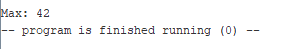
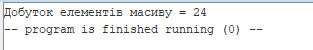

# Практична робота №4
## Студент: Матвійчук Роман
## Група: ІПЗ-4/2
## Тема: Асемблер RISC-V: арифметика, розгалуження, цикли, підпрограми
## Варіант: 8

# Задача 1.
Реалізував код за умовою задачі 1:

[Переглянути код practic4.asm](./practic4/practic4.asm)
```
.data
    array:  .word 15, 42, 7, 23, 11    # Тестовий масив
    length: .word 4                 # Довжина масиву 5
    msg:    .asciz "Max: "

.text
.globl main

main:
    # Завантаження адреси та довжини
    la a0, array # a0 - адреса масиву
    lw a1, length # a1 - довжина масиву 5

    # Початковий максимум
    lw s0, 0(a0) # s0 - масив, припускаємо, що 0 елемент - це максимум.
    li t1, 1 # t1 = i = 1 починаємо перевірку з 1 елемента.

loop:
    # Вихід за довжиною масиву (умова закінчення масиву)
    bge t1, a1, done # Якщо i >= N, завершити цикл

    # Обчислення адреси array[i]
    slli t2, t1, 2 # t2 = i \* 4 (зсув вліво на 2 біти для 4-байтних чисел)
    add t3, a0, t2 # t3 = адреса array[i] (база + зміщення)
    lw t4, 0(t3) # t4 = значення array[i]

    # Перевірка та оновлення максимуму
    blt t4, s0, skip # Якщо array[i] &lt; s0, пропускаємо оновлення
    mv s0, t4 # Інакше: новий максимум s0 = array[i]

skip:
    # i++
    addi t1, t1, 1
    j loop # Перехід на початок циклу

done:
    # Виведення тексту
    li a7, 4 # ecall 4: друк рядка
    la a0, msg
    ecall

    # Виведення максимуму
    li a7, 1 # ecall 1: друк цілого числа
    mv a0, s0
    ecall

    # Завершення програми
    li a7, 10 # ecall 10: завершення програми
    ecall
```
### Результат:


# Задача 2.
Реалізував підпрограму find_max

```
.data
    array:  .word 15, 42, 7, 23, 11   # Масив із п'яти чисел
    length: .word 5                   # Кількість елементів масиву
    msg:    .asciz "Max: "             # Повідомлення для виведення

.text
.globl main

main:
    # Завантаження адреси масиву та його довжини
    la a0, array                      # a0 = адреса масиву
    lw a1, length                     # a1 = кількість елементів

    # Виклик підпрограми пошуку найбільшого елемента
    jal ra, find_max                  # Перехід до find_max, адреса повернення в ra

    # Збереження знайденого максимуму
    mv t5, a0                         # t5 = результат роботи підпрограми

    # Виведення текстового повідомлення
    la a0, msg                        # a0 = адреса рядка
    li a7, 4                          # Код системного виклику для виведення рядка
    ecall                             # Виконання системного виклику

    # Виведення найбільшого елемента
    mv a0, t5                         # a0 = знайдений максимум
    li a7, 1                          # Код системного виклику для виведення числа
    ecall                             # Виконання системного виклику

    # Завершення програми
    li a7, 10                         # Код системного виклику завершення
    ecall                             # Завершення виконання програми


find_max:
    # Виділення місця в стеку для збереження регістрів
    addi sp, sp, -16                  # Зменшення вказівника стеку на 16 байтів
    sw ra, 12(sp)                     # Збереження адреси повернення
    sw s0, 8(sp)                      # Збереження попереднього значення s0
    sw s1, 4(sp)                      # Збереження попереднього значення s1

    # Ініціалізація пошуку максимуму
    mv s1, a0                         # s1 = адреса масиву
    mv s0, a1                         # s0 = кількість елементів
    lw t0, 0(s1)                      # t0 = перший елемент, початковий максимум
    li t1, 1                          # t1 = індекс наступного елемента

loop:
    # Перевірка, чи потрібно продовжувати цикл
    bge t1, s0, done                  # Якщо індекс >= довжини, перейти до done

    # Обчислення адреси поточного елемента масиву
    slli t2, t1, 2                    # t2 = індекс * 4 (одне число займає 4 байти)
    add t3, s1, t2                    # t3 = адреса поточного елемента
    lw t4, 0(t3)                      # t4 = значення поточного елемента

    # Порівняння поточного елемента з максимумом
    blt t4, t0, skip                  # Якщо t4 < максимуму, пропустити оновлення
    mv t0, t4                         # Інакше записати новий максимум у t0

skip:
    # Перехід до наступного елемента масиву
    addi t1, t1, 1                    # Збільшення індексу на 1
    j loop                            # Повернення на початок циклу

done:
    # Підготовка результату для повернення в головну програму
    mv a0, t0                         # a0 = знайдений максимальний елемент

    # Відновлення збережених регістрів зі стеку
    lw s1, 4(sp)                      # Відновлення попереднього значення s1
    lw s0, 8(sp)                      # Відновлення попереднього значення s0
    lw ra, 12(sp)                     # Відновлення адреси повернення
    addi sp, sp, 16                   # Звільнення місця в стеку

    ret                               # Повернення до головної програми
```
## Завдання 4. Реалізація підпрограми за Варіантом 8
*Підпрограма обчислення добутку масиву* *2, 3, 1, 4* *із дотриманням конвенції ABI*.

[Переглянути код practic4-variant8.asm](./practic4/practic4.asm)

```
.data
    array: .word 2, 3, 1, 4            # Тестовий масив за варіантом 8
    length: .word 4                    # Довжина масиву N = 4
    msg: .asciz "Добуток елементів масиву = " # Повідомлення для виведення

.text
.globl main

main:
    # Друк супровідного тексту
    li a7, 4                           # ecall 4: друк рядка
    la a0, msg                         # a0 = адреса повідомлення
    ecall                              # Виконання системного виклику

    # Передача аргументів та виклик підпрограми
    la a0, array                       # a0 = адреса початку масиву
    lw a1, length                      # a1 = довжина масиву (N = 4)
    jal ra, array_product              # Виклик підпрограми array_product

    # Виведення результату
    li a7, 1                           # ecall 1: друк цілого числа
    ecall                              # Виведення добутку з регістра a0

    # Завершення програми
    li a7, 10                          # ecall 10: завершення програми
    ecall                              # Виконання завершення

# Підпрограма: array_product
# Вхід: a0 — адреса масиву, a1 — довжина масиву N
# Вихід: a0 — добуток усіх елементів масиву

array_product:
    # Збереження регістра s0 у стеку
    addi sp, sp, -4                    # Виділення 4 байтів у стеку
    sw s0, 0(sp)                       # Збереження попереднього значення s0

    # Ініціалізація змінних
    li s0, 1                           # s0 = 1, початкове значення добутку
    li t1, 0                           # t1 = 0, початковий індекс масиву

loop:
    # Перевірка умови завершення циклу
    bge t1, a1, done                   # Якщо i >= N, перейти до done

    # Обчислення адреси поточного елемента
    slli t2, t1, 2                     # t2 = i * 4, оскільки .word займає 4 байти
    add t3, a0, t2                     # t3 = адреса елемента array[i]
    lw t4, 0(t3)                       # t4 = значення array[i]

    # Обчислення добутку
    mul s0, s0, t4                     # s0 = s0 * array[i]

    # Перехід до наступного елемента
    addi t1, t1, 1                     # Збільшення індексу: i = i + 1
    j loop                             # Повернення на початок циклу

done:
    # Підготовка результату для повернення
    mv a0, s0                          # a0 = обчислений добуток

    # Відновлення регістра та стеку
    lw s0, 0(sp)                       # Відновлення попереднього значення s0
    addi sp, sp, 4                     # Звільнення 4 байтів у стеку

    ret                                # Повернення до головної програми
```
## Результат


Розрахунок: 2 * 3 * 1 * 4=24
## Завданння 5.

| Етап виконання (крок) | Регістр `a0` (адреса / результат) | Регістр `a1` (довжина `N`) | Робочий регістр `t1` (індекс `i`) |
|---|---:|---:|---:|
| Точка зупинки (початок підпрограми) | `0x10010000` | `0x00000004` | `0x00000000` |
| Крок 1 (після 1-ї ітерації циклу) | `0x10010000` | `0x00000004` | `0x00000001` |
| Крок 2 (після 2-ї ітерації циклу) | `0x10010000` | `0x00000004` | `0x00000002` |
| Крок 3 (після 3-ї ітерації циклу) | `0x10010000` | `0x00000004` | `0x00000003` |
| Крок 3 (після 4-ї ітерації / вихід) | `0x10000018` | `0x00000004` | `0x00000004` |

**Висновок:** Покрокове відлагодження за допомогою інструмента *Step* підтверджує коректність роботи алгоритму циклу - значення в регістрі `a0` наприкінці підпрограми (`24`) повністю збігається з результатом ручного розрахунку та виводом у консоль RARS.

## Висновок
Під час виконання практичної роботи я засвоїв навички створення та відлагодження програм мовою асемблера RISC-V у середовищі RARS:

1. Роль регістра ra (Return Address): Інструкція jal автоматично зберігає адресу наступної команди у регістр ra, що дозволяє команді ret виконати перехід назад до моєї програми main.
2. Збереження s-регістрів у стеці: Згідно з конвенцією викликів ABI, регістри s0–s11 належать до категорії callee-saved. У підпрограмі array_product я зберіг початковий стан регістра s0 у стеці (sw s0, 0(sp)) перед початком обчислень та відновив його (lw s0, 0(sp)) безпосередньо перед поверненням ret, що гарантує цілісність даних моєї програми main.